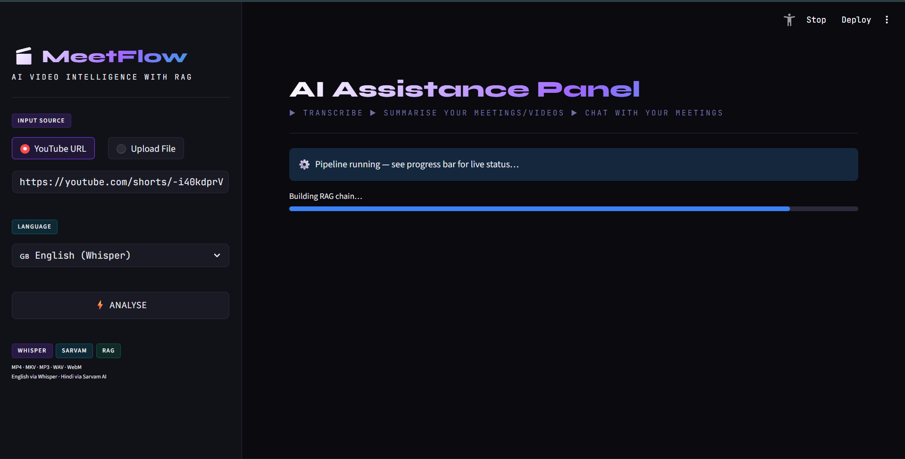
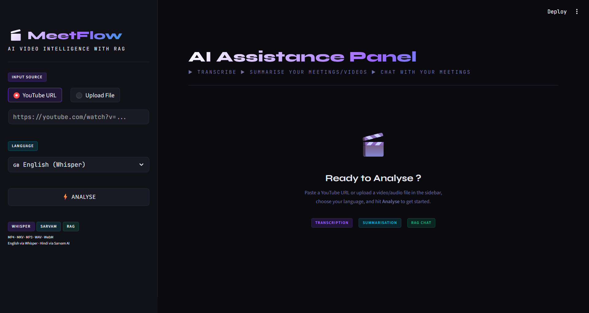
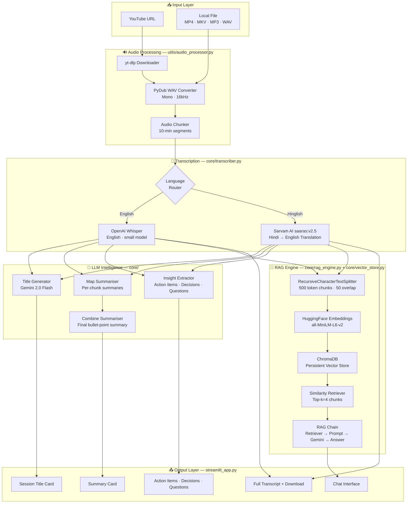
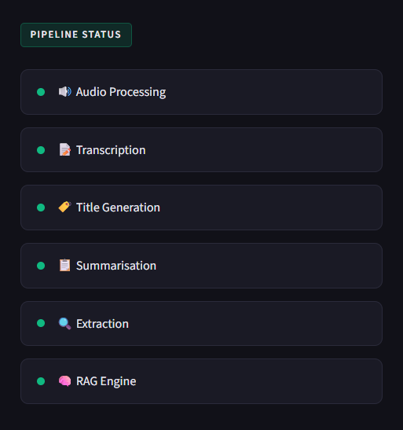
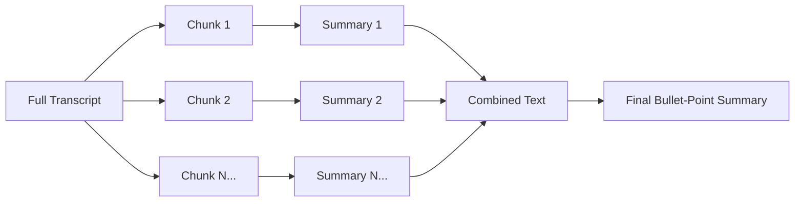
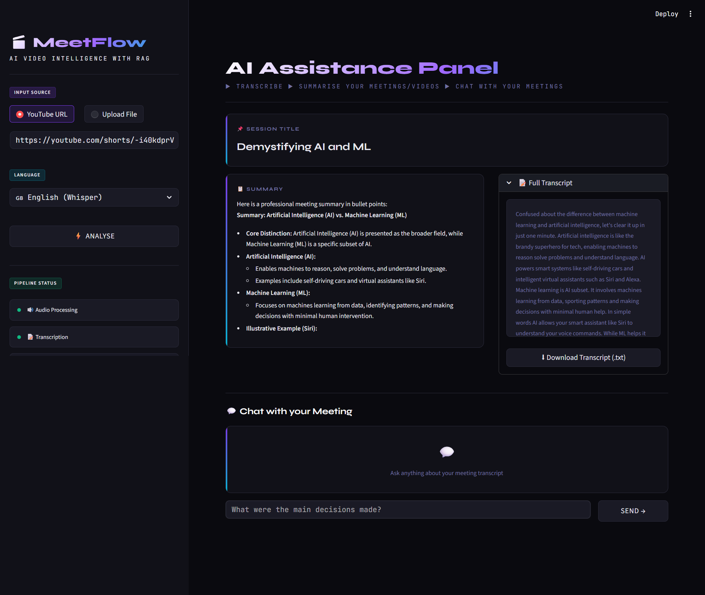
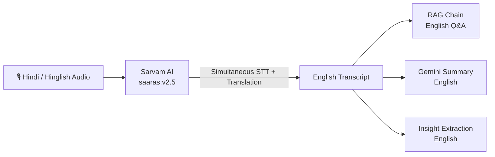
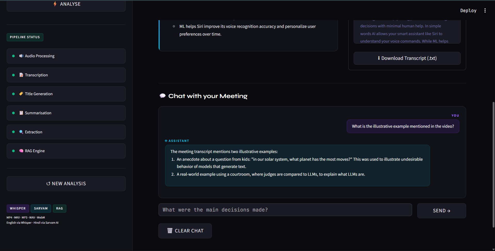
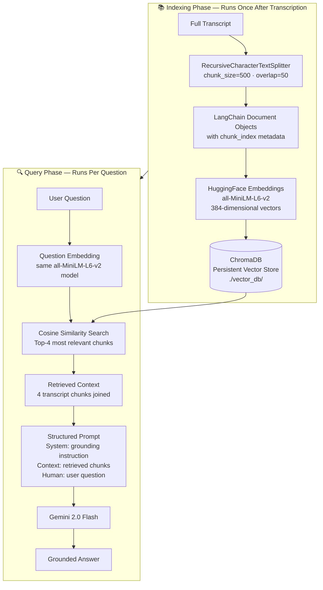
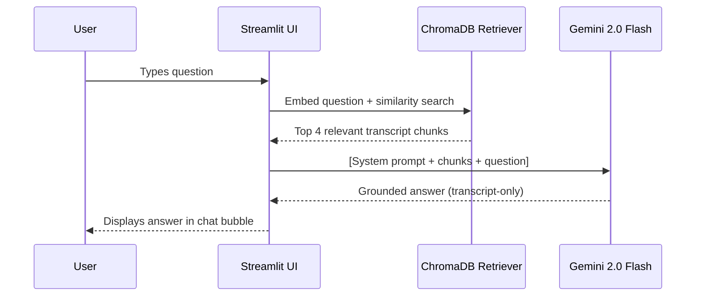

# 🎬 MeetFlow — AI Video & Meeting Intelligence Platform

<div align="center">



**Transform any video or meeting recording into structured intelligence — transcribe, summarise, extract insights, and chat with your content using RAG.**

[](https://python.org)
[](https://streamlit.io)
[](https://ai.google.dev)
[](https://openai.com/research/whisper)
[](https://www.trychroma.com)
[](LICENSE)

[🚀 Quick Start](#-getting-started) · [📖 Architecture](#-system-architecture) · [💬 RAG Chat](#-rag-chat--the-x-factor) · [🌐 Hindi Support](#-hindi--hinglish-support-the-star-feature)

</div>

---

## 📌 Table of Contents

- [Overview](#-overview)
- [Why MeetFlow?](#-why-meetflow)
- [Interface](#-interface)
- [System Architecture](#-system-architecture)
- [The Pipeline](#-the-pipeline--under-the-hood)
- [Results & Outputs](#-results--outputs)
- [⭐ Hindi/Hinglish Support](#-hindi--hinglish-support-the-star-feature)
- [💬 RAG Chat — Chat with your meetings/videos](#-rag-chat--the-x-factor)
- [Testing & Challenges](#-testing--challenges)
- [Getting Started](#-getting-started)
- [Tech Stack](#-tech-stack)
- [Developer](#-developer)

---

## 🧠 Overview

**MeetFlow** is a full-stack AI pipeline that ingests YouTube videos or local audio/video files, processes them through a multi-stage intelligence pipeline, and delivers:

- 📝 **Full verbatim transcripts** of any video or meeting
- 📋 **Professional bullet-point summaries** powered by Gemini 2.0 Flash
- ✅ **Action items**, 🔑 **Key decisions**, and ❓ **Open questions** automatically extracted
- 💬 **RAG-powered conversational chat** — ask any question about the content and get grounded, accurate answers from the transcript itself
- 🇮🇳 **Hindi & Hinglish transcription + English translation** via Sarvam AI — a first-class multilingual experience

MeetFlow is designed for professionals, researchers, and teams who consume large amounts of video content and need to extract structured knowledge from it efficiently.

---

## 🎯 Why MeetFlow?

> **The problem:** Hours of meetings, lectures, and video content sit unwatched or half-remembered. Notes are scattered. Key decisions get lost. Action items fall through the cracks.

> **The solution:** MeetFlow turns unstructured video into structured, queryable, persistent intelligence — in minutes.

| Without MeetFlow | With MeetFlow |
|---|---|
| Watch the entire recording again | Get a summary in seconds |
| Manually note action items | Auto-extracted and listed |
| Search through long videos | Ask a question, get an answer |
| Miss context from Hindi meetings | Full Hindi transcription + English RAG |
| No audit trail | Complete transcript downloaded as `.txt` |

---

## 🖥️ Interface

MeetFlow is built entirely with **Streamlit**, extended with custom CSS to deliver a production-grade dark UI — far beyond Streamlit's default aesthetic. The interface uses:

- **CSS variables** for a fully cohesive dark theme (`--bg`, `--surface`, `--accent`, `--accent-2`)
- **Syne** (display font) + **JetBrains Mono** (body font) for a technical, premium feel
- **Grid background**, glow effects, and animated pipeline status dots
- A **responsive card layout** that adapts based on content — empty sections are hidden, single results go full-width, multiple results split into columns automatically

> 📸 **Interface Screenshot:**
> 
> 

### Sidebar Controls
- **Input Source toggle** — switch between YouTube URL and local file upload
- **Language selector** — English (Whisper) or Hindi/Hinglish (Sarvam AI)
- **Live Pipeline Status** — animated dots showing each stage in real time
- **New Analysis** — wipes state and resets the full session

---

## 🏗️ System Architecture



---

## ⚙️ The Pipeline — Under the Hood

> 📸 **Pipeline Progress:**
>
> 

The pipeline is orchestrated in `streamlit_app.py` and `main.py` with six sequential stages. Each stage updates a live status dot in the sidebar — green when complete, pulsing purple when active.

### Stage 1 — 🔊 Audio Processing
```
Source → Download/Convert → WAV (Mono, 16kHz) → 10-min Chunks
```
- YouTube URLs are downloaded via **yt-dlp** with FFmpeg post-processing to extract clean WAV audio
- Local files (MP4, MKV, MOV, MP3, WAV, M4A, WebM) are converted using **PyDub**
- All audio is normalised to **mono channel at 16kHz** — the exact format Whisper and Sarvam expect
- Long recordings are chunked into **10-minute segments** to stay within transcription API limits

### Stage 2 — 📝 Transcription
```
WAV Chunks → [Whisper | Sarvam] → Full Text Transcript
```
- **English:** OpenAI Whisper (`small` model) runs **locally** — no API call, no cost, full privacy
- **Hindi/Hinglish:** Sarvam AI `saaras:v2.5` via REST API — transcribes AND translates to English simultaneously
- Sarvam chunks are further split into **25-second pieces** since the sync API enforces a 30s limit per request
- All chunk transcripts are concatenated into a single continuous `full_transcript` string

### Stage 3 — 🏷️ Title Generation
```
Transcript[:2000] → Gemini 2.0 Flash → "Short Professional Title"
```
- First 2000 characters of transcript are sent to Gemini with a strict instruction: generate a max 8-word professional title
- This gives the session a human-readable identifier without processing the full transcript

### Stage 4 — 📋 Summarisation (Map-Reduce)
```
Full Transcript → Chunks → Per-chunk Summaries → Combined Final Summary
```
- The transcript is split into **6000-token chunks** (with 200-token overlap) using LangChain's `RecursiveCharacterTextSplitter`
- Each chunk is independently summarised by Gemini (**map** phase)
- All partial summaries are concatenated and passed to Gemini again for a final **reduce** phase, producing a professional bullet-point summary
- This map-reduce approach handles transcripts of **any length** without hitting context limits



### Stage 5 — 🔍 Insight Extraction
```
Transcript → Gemini → [Action Items | Key Decisions | Open Questions]
```
- Three independent LangChain chains run against the full transcript
- Each uses a specialised system prompt targeting a specific output type
- Results are conditionally rendered — **empty results are hidden**, non-empty results expand to fill available width dynamically

### Stage 6 — 🧠 RAG Engine Build

```
Transcript → Chunks → Embeddings → ChromaDB → Retriever → LangChain RAG Chain
```
- The full pipeline for this stage is detailed in the [RAG Chat section](#-rag-chat--the-x-factor) below

---

## 📊 Results & Outputs

> 📸 **Results Screenshot:**
>
> 

After the pipeline completes, MeetFlow renders a rich results panel:

| Output | Description |
|---|---|
| **Session Title** | Auto-generated professional title for the meeting/video |
| **Summary** | Scrollable bullet-point summary, collapsing long content |
| **Full Transcript** | Complete verbatim transcript, scrollable, downloadable as `.txt` |
| **Action Items** | Tasks, owners, and deadlines extracted from the transcript |
| **Key Decisions** | All decisions made during the session |
| **Open Questions** | Unresolved topics needing follow-up |
| **RAG Chat** | Interactive Q&A grounded in the transcript |

**Smart layout logic:** If only one insight category has content, it takes full width. Two categories split 50/50. All three appear side by side. Empty cards are never rendered.

---

## 🌟 Hindi / Hinglish Support — The Star Feature

> **MeetFlow is one of the very few RAG pipelines that natively handles Hindi and code-switched (Hinglish) audio — transcribing it AND making it queryable in English.**



### How It Works
- **Sarvam AI** (`saaras:v2.5`) is a state-of-the-art Indian language speech model that performs **speech-to-text transcription AND English translation in a single API call** — no separate translation step needed
- Each audio piece (≤25s) is sent to `https://api.sarvam.ai/speech-to-text-translate`
- The returned English transcript feeds into the exact same downstream pipeline — summarisation, extraction, RAG — as an English recording would
- This means **Hindi team meetings, Hindi educational videos, and Hinglish podcasts** are all fully supported with zero code changes in the downstream pipeline

### Why Sarvam AI?
- Built specifically for Indian languages with vastly superior accuracy over generic STT models on Hindi/Hinglish audio
- The `saaras:v2.5` model handles code-switching (Hindi words in English sentences and vice versa) gracefully
- Direct English translation output means the RAG index is always in English, enabling precise semantic search regardless of the source language

---

## 💬 RAG Chat 

> 📸 **RAG Chat - Ask anything about the meeting/video**
>
> 

The RAG (Retrieval-Augmented Generation) chat is what transforms MeetFlow from a summarisation tool into an **interactive knowledge base**. Rather than asking a general-purpose LLM to answer from memory, every answer is **grounded strictly in the actual transcript**.


### Why RAG Over Direct LLM?

| Approach | Problem |
|---|---|
| Ask Gemini directly | Hallucinates — makes up details not in the video |
| Keyword search | Misses semantic meaning, returns wrong chunks |
| RAG | Retrieves relevant context → generates grounded answer |

### The RAG Pipeline — Step by Step



### Chunking Strategy

The transcript is chunked with **500 tokens per chunk and 50-token overlap**. This is intentionally smaller than the summarisation chunks (6000 tokens) because:

- **Smaller chunks = higher retrieval precision** — a 500-token chunk maps to ~30–45 seconds of speech, a semantically coherent unit
- **Overlap prevents boundary loss** — if a key sentence falls at a chunk boundary, the 50-token overlap ensures it appears in at least one complete chunk
- Each chunk carries `chunk_index` metadata for future re-ranking or citation features

### Embedding Model — `all-MiniLM-L6-v2`

- A lightweight (22M parameter) sentence transformer that maps text to **384-dimensional dense vectors**
- Runs **entirely locally on CPU** — no API call, no latency, no cost
- Chosen for its excellent balance of speed and semantic accuracy on short text passages
- Produces embeddings where semantically similar sentences cluster together in vector space — enabling meaningful similarity search

### The RAG Chain (LCEL)

```python
rag_chain = (
    {
        "context":  retriever | format_docs,   # fetch + join top-4 chunks
        "question": RunnablePassthrough(),      # pass question through unchanged
    }
    | prompt     # build structured message
    | llm        # Gemini 2.0 Flash
    | StrOutputParser()
)
```

Built using **LangChain Expression Language (LCEL)** — a declarative, composable pipeline that chains retrieval, prompting, and generation in a single readable expression.

### Grounding Guarantee

The system prompt explicitly instructs Gemini:

> *"Answer the user's question based ONLY on the meeting transcript context provided below. If the answer is not found in the context, say: 'I could not find this information in the meeting transcript.'"*

This ensures the model **refuses to hallucinate** — if the answer isn't in the transcript, it says so cleanly rather than fabricating a plausible-sounding response.

### Vector Store Persistence

ChromaDB persists to `./vector_db/` on disk. This means:
- The vector index survives app restarts
- Multiple sessions on the same transcript don't re-embed
- A `load_rag_chain()` function exists for future use cases where the index is pre-built



---

## 🧪 Testing & Challenges

### Testing Approach

MeetFlow was tested across multiple video types before release:

| Test Case | Input | Expected Output | Result |
|---|---|---|---|
| Short English YouTube Short (< 1 min) | YouTube URL | Full transcript + summary | ✅ Pass |
| Medium English video (5–10 min) | YouTube URL | Multi-chunk summary | ✅ Pass |
| Hindi YouTube Short | YouTube URL (Hinglish) | English transcript via Sarvam | ✅ Pass |
| Local MP4 upload | `.mp4` file | Converted + transcribed | ✅ Pass |
| RAG Chat accuracy | Question about specific detail | Grounded answer from transcript | ✅ Pass |
| Empty insights (no decisions made) | Short video | Cards hidden, not shown empty | ✅ Pass |

### Challenges Faced & How They Were Solved

#### 1. Mistral API Rate Limits (429 Errors)
**Problem:** The initial LLM backend was Mistral's free tier (1 RPM). The pipeline fires 6–8 sequential API calls, immediately exhausting the limit and crashing mid-pipeline.

**Attempted Fix:** Exponential backoff retry logic with `invoke_with_backoff()`. This caused a new issue — the retry loop itself would exhaust all attempts and raise `RuntimeError`, crashing the RAG chain build.

**Final Fix:** Migrated to **Gemini 2.5 Flash** (15 RPM, 1500 RPD free tier) and removed all retry logic. Gemini's generous free limits handle the full pipeline without rate limiting.

#### 2. Sarvam API 30-Second Audio Limit
**Problem:** Sarvam's sync STT-translate API rejects audio longer than 30 seconds with a 413 error.

**Fix:** Each 10-minute chunk is further sliced into **25-second pieces** (5s safety margin) before sending to Sarvam. Transcripts from all pieces are concatenated after the API calls complete.

---

## 🚀 Getting Started

### Prerequisites

- Python 3.12+
- [FFmpeg](https://ffmpeg.org/download.html) installed and on PATH
- Google Gemini API key — [Get free key at aistudio.google.com](https://aistudio.google.com)
- Sarvam AI API key (only needed for Hindi/Hinglish) — [Get at sarvam.ai](https://sarvam.ai)

### Installation

```bash
# 1. Clone the repository
git clone https://github.com/priyanshu09102003/meetflow.git
cd meetflow

# 2. Create and activate virtual environment
python -m venv .venv

# Windows
.venv\Scripts\Activate.ps1

# macOS/Linux
source .venv/bin/activate

# 3. Install dependencies
pip install -r requirements.txt

# 4. Set up environment variables
cp .env.example .env
# Edit .env and add your API keys
```

### Environment Variables

Create a `.env` file in the project root:

```env
GOOGLE_API_KEY=your_gemini_api_key_here
SARVAM_API_KEY=your_sarvam_api_key_here      # Optional — only for Hindi
SARVAM_STT_MODEL = saaras:v2.5
WHISPER_MODEL=small                            # Options: tiny, base, small, medium, large
```

### Run the App

```bash
streamlit run streamlit_app.py
```

Visit `http://localhost:8501` in your browser.

### Project Structure

```
meetflow/
├── streamlit_app.py          # Main Streamlit UI + pipeline orchestration
├── main.py                   # CLI entry point
├── requirements.txt
├── .env
├── core/
│   ├── llm_utils.py          # Centralised LLM config (Gemini)
│   ├── transcriber.py        # Whisper + Sarvam transcription routing
│   ├── summarize.py          # Map-reduce summarisation + title generation
│   ├── extractor.py          # Action items, decisions, questions
│   ├── rag_engine.py         # RAG chain construction + Q&A
│   └── vector_store.py       # ChromaDB + HuggingFace embeddings
├── utils/
│   └── audio_processor.py    # yt-dlp download, WAV conversion, chunking
├── vector_db/                # ChromaDB persistent storage (auto-created)
└── downloades/               # Temporary audio downloads (auto-created)
```

---

## 🛠️ Tech Stack

| Component | Technology | Purpose |
|---|---|---|
| UI Framework | Streamlit 1.35+ | Web interface |
| LLM | Gemini 2.0 Flash | Summarisation, extraction, RAG answers |
| English STT | OpenAI Whisper (small) | Local transcription |
| Hindi STT | Sarvam AI saaras:v2.5 | Hindi/Hinglish transcription + translation |
| Embeddings | all-MiniLM-L6-v2 | Semantic vector embeddings |
| Vector Store | ChromaDB | Persistent similarity search |
| LLM Framework | LangChain (LCEL) | Chain composition |
| Audio Processing | PyDub + FFmpeg | Format conversion and chunking |
| YouTube Download | yt-dlp | Audio extraction from YouTube |

---

## 👨‍💻 Developer

<div align="center">

**Priyanshu Paul**

*Building AI systems with clear intent*

[](https://github.com/priyanshu09102003)
[](https://www.linkedin.com/in/priyanshu-paul-59221228a/)

</div>

---

<div align="center">

**MeetFlow** — Built with intent. Powered by AI.

⭐ Star this repo if you found it useful!

</div>