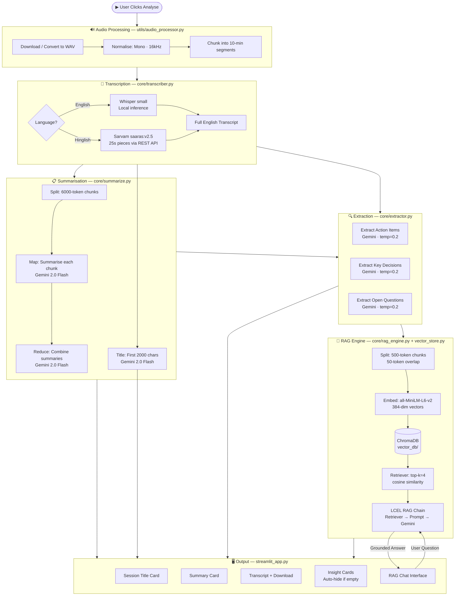
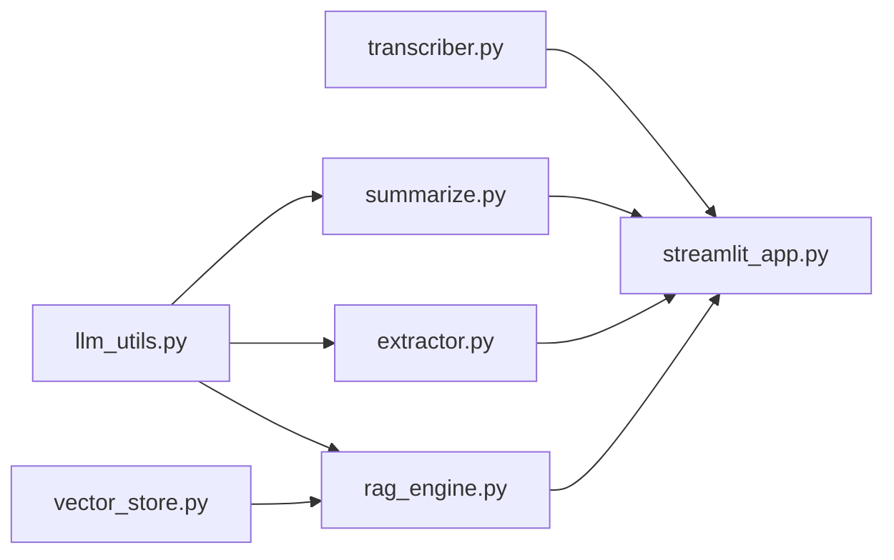

# 🧠 `core/` — Intelligence Pipeline

The `core/` directory is the **brain of MeetFlow**. Every AI operation — transcription routing, summarisation, insight extraction, embedding, retrieval, and generation — lives here. Each module has a single, well-defined responsibility, and together they form a sequential intelligence pipeline that converts raw audio transcript text into structured, queryable knowledge.

---

## 📁 File Overview

| File | Responsibility |
|---|---|
| `llm_utils.py` | Centralised LLM configuration — single source of truth for the Gemini client |
| `transcriber.py` | Routes audio chunks to Whisper (English) or Sarvam AI (Hindi/Hinglish) |
| `summarize.py` | Map-reduce summarisation pipeline + session title generation |
| `extractor.py` | Extracts action items, key decisions, and open questions |
| `rag_engine.py` | Builds and queries the RAG chain (retriever + prompt + LLM) |
| `vector_store.py` | Creates ChromaDB vector store from transcript chunks using HuggingFace embeddings |

---

## 📄 `llm_utils.py`

### What It Does
A single-function module that acts as the **centralised LLM factory** for the entire application. Every file in `core/` that needs an LLM imports `get_llm()` from here — nothing hardcodes an LLM directly.

```python
from langchain_google_genai import ChatGoogleGenerativeAI

def get_llm(temperature=0.3):
    return ChatGoogleGenerativeAI(
        model="gemini-2.0-flash",
        google_api_key=os.getenv("GOOGLE_API_KEY"),
        temperature=temperature,
        convert_system_message_to_human=True,
    )
```

### Why It's Necessary
Without centralisation, switching LLM providers (as happened when migrating from Mistral to Gemini) requires hunting down and editing every file that instantiates an LLM. With `llm_utils.py`, the entire application's LLM backend changes with **one line edit** in one file.

- `convert_system_message_to_human=True` ensures Gemini (which uses a different message format internally) correctly handles the system/human message structure that LangChain uses
- `temperature` is parameterised so summarisation (0.3 — creative but grounded) and extraction (0.2 — deterministic) can use different values

---

## 📄 `transcriber.py`

### What It Does
Handles the transcription of audio chunk files into text. It is a **router** — it inspects the `language` parameter and sends each chunk to the appropriate transcription engine.

#### Whisper Path (English)
```python
def transcribe_chunk_whisper(chunk_path: str) -> str:
    model = load_model()  # lazy-loaded singleton
    result = model.transcribe(chunk_path, task="transcribe")
    return result["text"]
```
- Uses OpenAI's **Whisper** (`small` model by default, configurable via `WHISPER_MODEL` env var)
- Runs **entirely locally** — no API call, no internet dependency after initial model download
- The model is a **singleton** — loaded once and reused across all chunks to avoid repeated disk I/O

#### Sarvam Path (Hindi/Hinglish)
```python
def transcribe_chunk_sarvam(chunk_path: str) -> str:
    # Splits chunk into ≤25s pieces
    # Sends each to Sarvam's speech-to-text-translate endpoint
    # Returns concatenated English transcript
```
- Sarvam's sync API enforces a **30-second audio limit** per request
- Each 10-minute chunk is further sliced into **25-second pieces** (5s safety margin)
- Each piece is POSTed to `https://api.sarvam.ai/speech-to-text-translate` with model `saaras:v2.5`
- Sarvam performs **simultaneous transcription AND translation** — the response is already in English
- Temporary piece files are cleaned up after each API call

#### Routing
```python
def transcribe_chunk(chunk_path, language="english"):
    if language.lower() == "hinglish":
        return transcribe_chunk_sarvam(chunk_path)
    return transcribe_chunk_whisper(chunk_path)
```

### Why It's Necessary
A single transcription engine cannot handle both English and Hindi optimally. Whisper's multilingual mode on Hindi produces lower accuracy than Sarvam's purpose-built Indian language model. Separating the routing logic here keeps downstream code completely unaware of which engine ran — it just receives a clean English string.

---

## 📄 `summarize.py`

### What It Does
Implements a **map-reduce summarisation pipeline** and a **title generator**, both powered by Gemini 2.0 Flash via LangChain LCEL chains.

#### Map-Reduce Summarisation

**Why map-reduce?** A long meeting transcript can easily exceed 10,000–50,000 tokens. Gemini 2.0 Flash has a large context window, but sending the entire transcript in one call is expensive and produces a less structured output. Map-reduce solves this by:

1. **Splitting** the transcript into 6000-token chunks (200-token overlap)
2. **Mapping** — each chunk is independently summarised by Gemini (parallel in concept, sequential in implementation)
3. **Reducing** — all partial summaries are combined and sent to Gemini for a final, professional bullet-point summary

```python
# MAP phase
map_chain = map_prompt | llm | StrOutputParser()
chunk_summaries = [map_chain.invoke({"text": chunk}) for chunk in chunks]

# REDUCE phase
combined = "\n\n".join(chunk_summaries)
combined_chain = combined_prompt | llm | StrOutputParser()
final_summary = combined_chain.invoke(combined)
```

#### Title Generation
Sends the first 2000 characters of the transcript to Gemini with a strict instruction to produce a maximum 8-word professional title. Truncating to 2000 characters keeps this call fast and cheap — the title only needs the opening context.

### Why It's Necessary
Meetings and videos can run for hours. Nobody wants to read a raw 40,000-word transcript. The map-reduce approach produces a **faithful, structured, length-independent summary** that captures all key points without hallucinating content that wasn't in the original.

---

## 📄 `extractor.py`

### What It Does
Runs three independent LangChain chains against the full transcript, each targeting a specific category of structured output:

| Function | Extracts |
|---|---|
| `extract_action_items()` | Tasks with owner and deadline |
| `extract_key_decisions()` | Decisions made during the session |
| `extract_questions()` | Unresolved questions needing follow-up |

Each chain is built by `build_chain(system_prompt)` — a factory function that wires together `get_llm()`, a `ChatPromptTemplate`, and a `StrOutputParser` using LCEL:

```python
def build_chain(system_prompt: str):
    llm = get_llm(temperature=0.2)  # lower temp for deterministic extraction
    return (
        RunnablePassthrough()
        | RunnableLambda(lambda x: {"text": x})
        | ChatPromptTemplate.from_messages([
            ("system", system_prompt),
            ("human", "{text}"),
        ])
        | llm
        | StrOutputParser()
    )
```

Temperature is set to **0.2** (lower than summarisation) because extraction should be deterministic — we want Gemini to find what's there, not creatively interpret it.

### Why It's Necessary
A general summary loses the actionability of a meeting. Explicitly extracting action items, decisions, and open questions turns a passive summary into an **active work product** — something a team can act on immediately without re-reading the transcript.

---

## 📄 `rag_engine.py`

### What It Does
Constructs and queries a **Retrieval-Augmented Generation chain** that grounds all answers in the actual transcript. See the main README's RAG Chat section for the full deep-dive — this file implements:

- `build_rag_chain(transcript)` — indexes the transcript into ChromaDB and builds the LCEL RAG chain
- `load_rag_chain()` — loads a pre-existing ChromaDB index (for future use)
- `ask_question(rag_chain, question)` — invokes the chain and returns a grounded answer

The RAG chain using LCEL:
```python
rag_chain = (
    {
        "context":  retriever | RunnableLambda(format_docs),
        "question": RunnablePassthrough(),
    }
    | prompt
    | llm
    | StrOutputParser()
)
```

### Why It's Necessary
Summarisation loses detail. A user who wants to know **exactly what was said about a specific topic** needs to query the transcript directly. RAG enables this by retrieving only the relevant portions of the transcript and grounding the LLM's response in them — preventing hallucination.

---

## 📄 `vector_store.py`

### What It Does
Handles the creation and loading of the **ChromaDB vector store** that powers the RAG retriever.

#### Building the Store
```python
def build_vector_store(transcript: str) -> Chroma:
    # 1. Split transcript into 500-token chunks (50 overlap)
    # 2. Wrap each chunk in a LangChain Document with chunk_index metadata
    # 3. Embed all documents using all-MiniLM-L6-v2
    # 4. Store in ChromaDB at ./vector_db/
```

#### Embedding Model — `all-MiniLM-L6-v2`
- A **22M parameter sentence transformer** from HuggingFace
- Maps text to **384-dimensional dense vectors**
- Runs **100% locally on CPU** — fast, free, private
- Excellent semantic accuracy for short text passages (exactly what 500-token chunks are)

#### Why 500-Token Chunks?
Smaller chunks than the summarisation stage (6000 tokens) because:
- Retrieval precision increases with smaller chunks — each chunk maps to ~30–45 seconds of speech
- The retriever fetches top-k=4 chunks, giving the LLM ~2000 tokens of focused context
- 50-token overlap prevents key sentences at boundaries from being missed

### Why It's Necessary
The vector store is what makes semantic search possible. Without it, finding relevant parts of a 10,000-word transcript for a given question would require scanning the entire text every time. ChromaDB enables **sub-second similarity search** across the entire transcript regardless of length.

---

## 🔄 Complete Pipeline Flowchart



---

## 🔗 Inter-Module Dependencies



Every LLM-consuming module depends on `llm_utils.py`. The RAG engine depends on `vector_store.py`. All modules feed their outputs to `streamlit_app.py` for rendering. `transcriber.py` is the sole consumer of audio chunks from `utils/`.