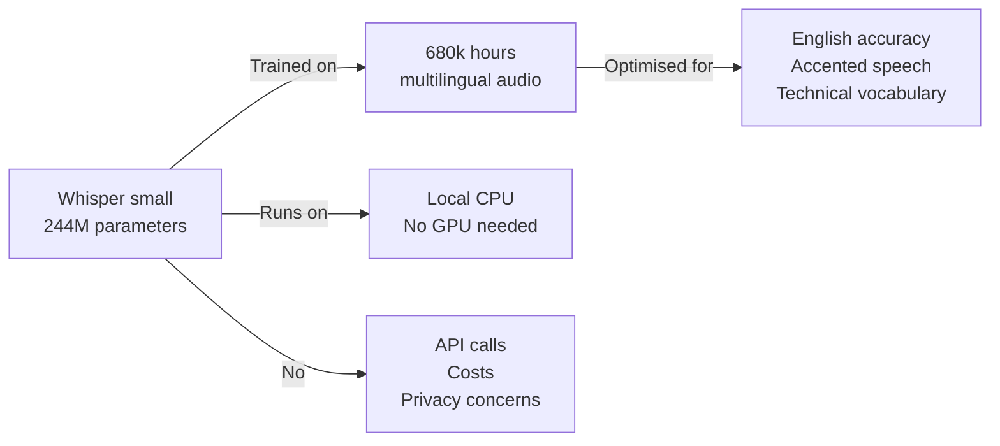
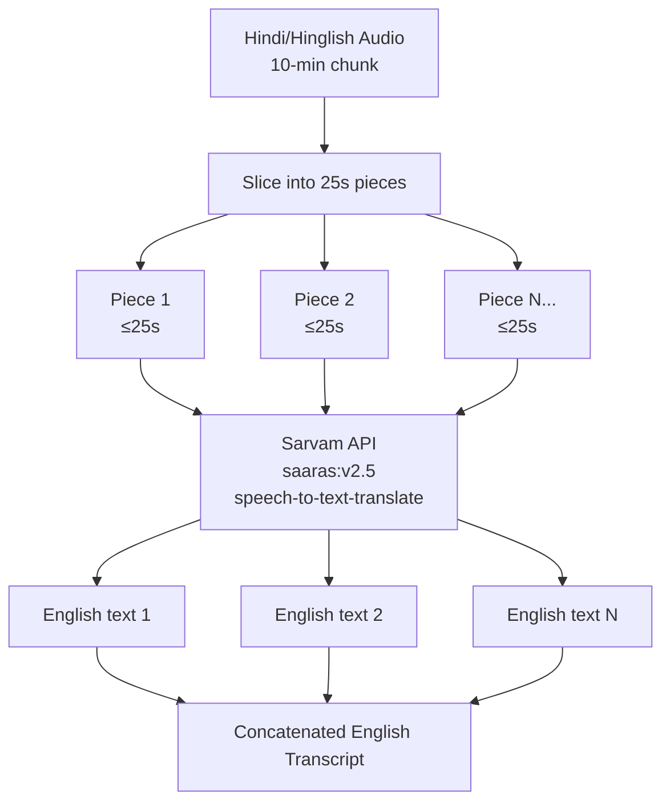

# 🔊 `utils/` — Audio Processing Layer

The `utils/` directory contains the **data ingestion and audio processing layer** of MeetFlow. Before any AI pipeline can run, raw input (a YouTube URL or a local video/audio file) must be converted into clean, standardised audio chunks that downstream transcription engines can consume. That is exactly what `audio_processor.py` does.

---

## 📄 `audio_processor.py`

### Overview

`audio_processor.py` is the **entry point of the entire MeetFlow pipeline**. It accepts either a YouTube URL or a local file path, processes it into a WAV audio file in the correct format, and splits it into manageable chunks for transcription. It is called first in both `main.py` and `streamlit_app.py` — nothing downstream runs until this module completes successfully.

```
Input (URL or File Path)
        │
        ▼
┌───────────────────┐
│  Download / Read  │  yt-dlp (YouTube) or direct path (local)
└────────┬──────────┘
         │
         ▼
┌───────────────────┐
│  Convert to WAV   │  PyDub → Mono · 16kHz · PCM
└────────┬──────────┘
         │
         ▼
┌───────────────────┐
│  Chunk Audio      │  10-minute segments → list of .wav paths
└───────────────────┘
         │
         ▼
   [chunk_0.wav, chunk_1.wav, ..., chunk_n.wav]
```

---

## 🔧 Functions

### `download_youtube_audio(url: str) -> str`

Downloads audio from a YouTube URL using **yt-dlp** and converts it to WAV format using FFmpeg as a post-processor.

```python
ydl_opts = {
    "format": "bestaudio/best",
    "outtmpl": output_path,
    "postprocessors": [{
        "key": "FFmpegExtractAudio",
        "preferredcodec": "wav",
        "preferredquality": "192",
    }],
    "quiet": True,
}
```

**Key decisions:**
- `format: "bestaudio/best"` — always selects the highest quality audio stream available (typically Opus at 160kbps or AAC at 128kbps, depending on the video)
- `preferredcodec: "wav"` — WAV is uncompressed PCM, which both Whisper and Sarvam require for accurate transcription. Compressed formats like MP3 introduce artifacts that reduce STT accuracy
- `quiet: True` — suppresses yt-dlp's verbose download progress from appearing in the Streamlit UI

**Returns:** The path to the downloaded `.wav` file on disk.

---

### `convert_to_wav(input_path: str) -> str`

Converts any locally uploaded audio or video file to WAV format using **PyDub**.

```python
def convert_to_wav(input_path: str) -> str:
    output_path = os.path.splitext(input_path)[0] + "_converted.wav"
    audio = AudioSegment.from_file(input_path)
    audio = audio.set_channels(1).set_frame_rate(16000)  # Mono · 16kHz
    audio.export(output_path, format="wav")
    return output_path
```

**Key decisions:**

| Setting | Value | Reason |
|---|---|---|
| Channels | 1 (Mono) | Whisper and Sarvam both expect mono audio. Stereo doubles file size with no accuracy gain |
| Sample Rate | 16,000 Hz | Whisper was trained on 16kHz audio. Sarvam's API also expects 16kHz. Using any other rate degrades accuracy |
| Format | WAV (PCM) | Uncompressed — no lossy artifacts. Direct byte-level access makes chunking accurate |

PyDub uses **FFmpeg** under the hood to handle format detection and decoding. This means any format FFmpeg supports — MP4, MKV, MOV, WebM, AVI, M4A, MP3 — is automatically handled without format-specific code.

---

### `chunk_audio(wav_path: str, chunk_minutes: int = 10) -> list`

Splits a WAV file into fixed-length segments and saves each as a separate `.wav` file.

```python
def chunk_audio(wav_path: str, chunk_minutes: int = 10) -> list:
    audio = AudioSegment.from_wav(wav_path)
    chunk_ms = chunk_minutes * 60 * 1000  # 10 minutes in milliseconds

    chunks = []
    for i, start in enumerate(range(0, len(audio), chunk_ms)):
        chunk = audio[start: start + chunk_ms]
        chunk_path = f"{wav_path}_chunk_{i}.wav"
        chunk.export(chunk_path, format="wav")
        chunks.append(chunk_path)

    return chunks
```

**Why 10-minute chunks?**
- **Whisper** has no hard file size limit but performs best on shorter segments — accuracy and speed are both optimal under 10 minutes
- **Sarvam** has a hard **30-second limit** per request. The 10-minute chunks are further sliced into 25-second pieces inside `transcriber.py` — chunking at the audio layer first keeps the files manageable on disk
- 10 minutes maps cleanly to a typical "topic block" in meetings, making the chunking semantically reasonable

**Returns:** An ordered list of file paths — `[chunk_0.wav, chunk_1.wav, ..., chunk_n.wav]`. The order is preserved so transcripts are concatenated in the correct temporal order.

---

### `process_input(source: str) -> list`

The **public API** of this module — the only function called by `streamlit_app.py` and `main.py`.

```python
def process_input(source: str) -> list:
    if source.startswith("http://") or source.startswith("https://"):
        wav_path = download_youtube_audio(source)
    else:
        wav_path = convert_to_wav(source)

    chunks = chunk_audio(wav_path)
    return chunks
```

Routes to the correct ingestion path based on the source string, then always passes through `chunk_audio` regardless of source. The caller receives a clean list of `.wav` chunk paths and never needs to know how the audio was obtained.

---

## 🎙️ Why These Models Were Chosen

### OpenAI Whisper — English Transcription

**What it is:** An open-source automatic speech recognition (ASR) model trained by OpenAI on 680,000 hours of multilingual audio from the web.

**Why Whisper over alternatives:**

| Alternative | Problem |
|---|---|
| Google Cloud Speech-to-Text | Paid per minute, requires GCP setup |
| AWS Transcribe | Paid, requires AWS credentials |
| AssemblyAI | Paid API, adds external dependency |
| Whisper (chosen) | Free, open-source, runs locally, no API key, high accuracy |

**Why the `small` model:**
- **4 models available:** `tiny` (39M params) → `base` (74M) → `small` (244M) → `medium` (769M) → `large` (1.5B)
- `small` hits the sweet spot — **significantly better accuracy than `tiny`/`base`** for accented English, technical vocabulary, and overlapping speech, while remaining fast on CPU (no GPU required)
- Configurable via `WHISPER_MODEL` environment variable — power users can upgrade to `medium` or `large` for maximum accuracy at the cost of speed

**Local inference advantage:** Whisper runs entirely on the local machine. Meeting content never leaves the user's computer for transcription — a significant privacy advantage for confidential business meetings.



---

### Sarvam AI `saaras:v2.5` — Hindi/Hinglish Transcription

**What it is:** A state-of-the-art Indian language speech model built specifically for the linguistic complexity of Indian languages, dialects, and code-switching between Hindi and English.

**Why Sarvam AI over Whisper for Hindi:**

| Model | Hindi Accuracy | Code-switching (Hinglish) | Translation |
|---|---|---|---|
| Whisper (multilingual) | Moderate | Poor | Separate step needed |
| Google Translate + STT | Moderate | Poor | Two API calls |
| Sarvam `saaras:v2.5` | Excellent | Excellent | Simultaneous |

**The decisive advantage — simultaneous STT + translation:**
Sarvam's `speech-to-text-translate` endpoint performs transcription AND English translation in a **single API call**. This means:
- No separate translation step
- No translation latency
- The downstream RAG pipeline receives clean English text regardless of whether the source was English or Hindi
- One less API dependency (no Google Translate or similar)

**Handling the 30-second limit:**
Sarvam's sync API enforces a 30-second maximum per request. The solution implemented in `transcriber.py`:

```
10-min chunk → sliced into 25s pieces → each piece → Sarvam API → transcript piece
All pieces concatenated → full chunk transcript
```

The 25-second target (vs the 30-second limit) provides a 5-second safety margin to account for the fact that PyDub's millisecond-level slicing occasionally produces pieces slightly longer than the calculated duration due to frame boundary rounding.



---

## 🗂️ Directory Configuration

```python
DOWNLOAD_DIR = 'downloades'
os.makedirs(DOWNLOAD_DIR, exist_ok=True)
```

Downloaded YouTube audio is stored in `./downloades/` (auto-created). This is a temporary directory — in production deployments, a cleanup job or `tempfile`-based approach would be used. Locally, it persists between runs, which can be useful for debugging specific audio files.

---

## 🔗 Integration with the Pipeline

`audio_processor.py` is the **only module in `utils/`** and serves as the clean boundary between raw input and the AI pipeline. After `process_input()` returns:

```
streamlit_app.py / main.py
        │
        │  chunks = process_input(source)    ← audio_processor.py
        │
        │  transcript = transcribe_all(chunks, language)    ← core/transcriber.py
        │
        ▼  (rest of pipeline)
```

The transcriber, summariser, extractor, and RAG engine never touch the file system or concern themselves with where audio came from. They receive a list of paths and work from there.